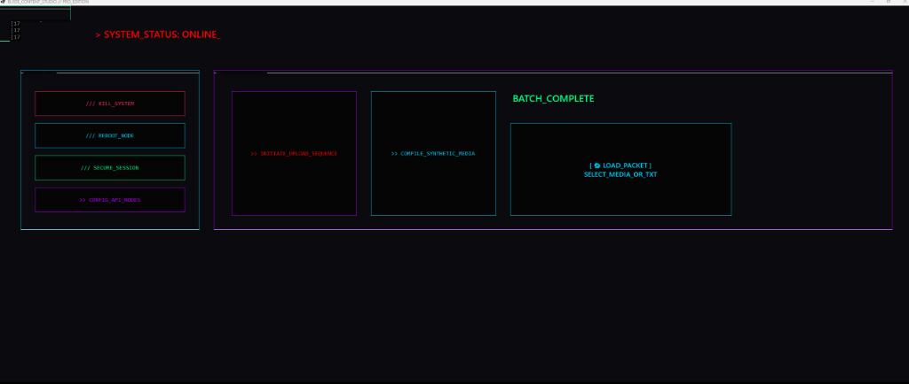

# ⚡ BLVDE Content Studio [PRO]

> **The Ultimate Multi-Platform Content Orchestrator.**

BLVDE Content Studio is a premium Windows application (C# / .NET 8.0) designed for high-speed, automated social media distribution. Seamlessly upload videos and verified links to TikTok, Instagram, and YouTube Shorts simultaneously from a single, high-resolution command terminal.

## 📥 Download

> [!TIP]
> **[Download the Latest Stable Version (v11.2-PRO)](https://github.com/ExploitDev9989/-BLVDE-Content-Studio-PRO/releases)**
> *Note: For Windows 10/11. Requires .NET 8.0 Runtime.*

## 📸 Dashboard Preview [2K]

## ✨ Key Features

- **🚀 Triple-Uplink**: Post to TikTok, Instagram, and YouTube Shorts in one click.
- **🖥️ Cyber-Midnight UI**: Optimized for 2160x1080 (Ultra-Wide) high-resolution displays.
- **🛡️ Secure Token Handling**: Managed via `blotato_config.json` with multi-node support.
- **📦 Verified Link Conversion**: Automatically converts Google Drive "View" links to direct download streams for server-side processing.
- **🛰️ Remote Control**: Listen for `remote_command.txt` triggers for external integration.
- **💻 Built-in Terminal**: Real-time logging and command execution for power users.

## 🛠️ Installation

1. Clone the repository: `git clone https://github.com/USER/BLVDEContentStudio.git`
2. Open the solution in **Visual Studio 2022**.
3. Ensure you have **.NET 8.0 SDK** installed.
4. Restore NuGet packages (`Newtonsoft.Json`).
5. Build and Run.

## ⚙️ Configuration

Launch the application and use the **[ >> CONFIG_API_NODES ]** button to link your Blotato API key and platform-specific numeric IDs.

## ⚖️ License

Private / Confidential. (c) 2025 BLVDE Studios.
